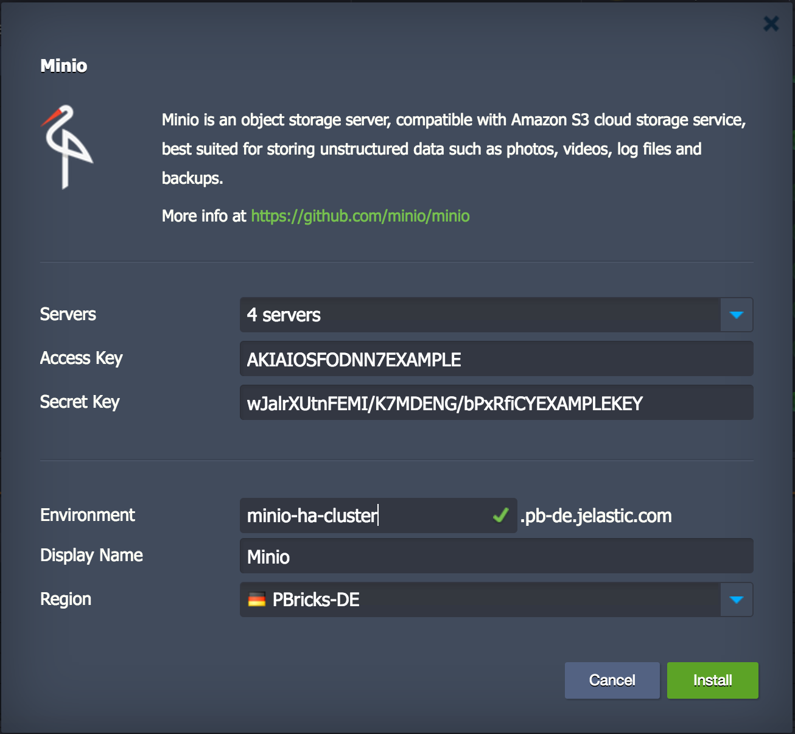

# Minio

S3 compatible object storage server in Docker containers

### Topology

### Setup Wizard

### Deploy 

 

### Logs and Troubleshooting
- Logs https://docs.jelastic.com/view-log-files
- SSH Access https://docs.jelastic.com/ssh-access
