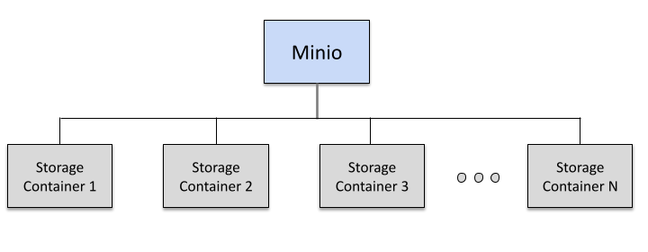

# Minio Cluster based on NFS

Minio is a high-performance, distributed object storage system that is compatible with the Amazon S3 API. By leveraging NFS (Network File System), you can set up a Minio cluster to provide scalable and resilient storage solutions. This guide will walk you through the process of configuring a Minio cluster using NFS, ensuring high availability and data redundancy for your storage needs.

> **Note:** MinIO has officially moved its Community Edition into [maintenance mode](https://github.com/minio/minio/blob/master/README.md). No new features will be developed going forward. As a result, the *MinIO Cluster* integration for Virtuozzo Application Platform will also be kept in maintenance mode.

## Topology

## Deploy

Log into your Virtuozzo Application Platform account and [import](https://www.virtuozzo.com/application-platform-docs/environment-import/) link to the _**manifest.jps**_ file from above.

Within the appeared form, you need to provide the following data:

- **Volumes** - specify the required cluster size by choosing among the predefined options to create 1 (for development), 6, or 16 Minio nodes
- **Access / Secret Key** - leave as is; keys are automatically generated for you
- **Environment** - type in the preferred name for your Minio storage cluster (which, together with your platform domain, will constitute an internal environment name)
- **Display Name** - optionally, add an [alias name](https://www.virtuozzo.com/application-platform-docs/environment-aliases/) to be displayed for the environment in the dashboard
- **Region** - select a [hardware set](https://www.virtuozzo.com/application-platform-docs/environment-regions/) for your environment to be hosted (this option is active only if several regions are available)

Alternatively, you can use the following button to automatically register on one of the [public Platforms](https://www.virtuozzo.com/application-platform-partners/) and immediately initiate Minio Cluster based on NFS installation:

## Logs and Troubleshooting

- Logs https://www.virtuozzo.com/application-platform-docs/view-log-files/
- SSH Access https://www.virtuozzo.com/application-platform-docs/ssh-access/
